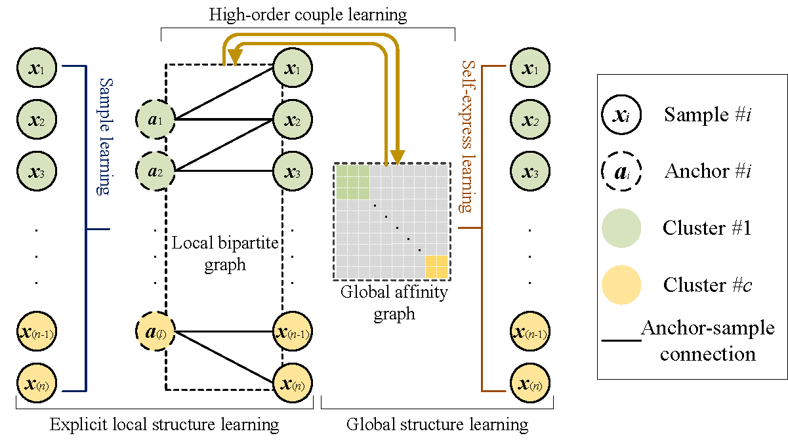

## [Explicit Local Coupling Global Structure Clustering](https://ieeexplore.ieee.org/abstract/document/10098829)

---
**Abstract**: Graph-based clustering has become an active topic due to the efficiency in characterizing the relationships between the samples via graph. To improve the quality of graph, recent works propose to utilize global and local information. However, existing methods may lead to a degenerated graph when facing noisy and uneven distributed data. Since (1) they preserve the local information by referring the similarity between each sample-pair, whose confidence is easily disturbed by the poor quality samples; and, (2) although the global information is relatively robust to the noisy, existing methods have island effect that lies between local and global structures learning, such that the information of both can not be utilized mutually. To alleviate these issues, this paper presents explicit local coupling global structure clustering (ELGSC) to explicitly learn the local structure and global structure information via a coupling scheme. To be specific, we learn (l<<n) pseudo samples as the anchors to reflect local hot spots distribution, where n is the number of samples. By referring the relationship between each anchorsample pair, ELGSC is capable of obtaining an effective local bipartite graph to capture the local structure. Meanwhile, the self-expressiveness learning is adopted to pursue a lower-rank global affinity graph. Finally, a higher-order coupling learning framework is proposed to couple the learning of global affinity graph and local bipartite graph. Thus, local and global structure information could be propagated each other on both graphs. The experimental results on real datasets demonstrate the efficacy of the proposed method over state-of-the-arts.



---
### Usage

1. Open MATLAB on your computer.

2. Run the `demo.m` script located in the project directory.

3. Follow the instructions provided by the script to perform the desired tasks.

### Troubleshooting

If you encounter any issues or errors during the execution of the script, please try the following steps:

1. Check that you have MATLAB version 2018 or above installed on your system.


2. Verify that the input data or parameters are correctly provided.

### Reference

```
@ARTICLE{10098829,
  author={Li, Haoran and Guo, Yulan and Ren, Zhenwen and Richard Yu, F. and You, Jiali and You, Xiaojian},
  journal={IEEE Transactions on Circuits and Systems for Video Technology}, 
  title={Explicit Local Coupling Global Structure Clustering}, 
  year={2023},
  volume={},
  number={},
  pages={1-1},
  doi={10.1109/TCSVT.2023.3266283}
  }
```